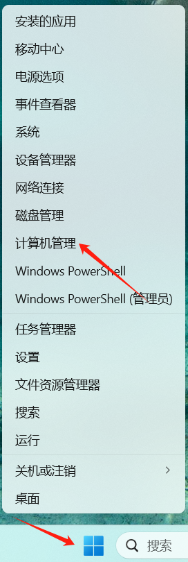
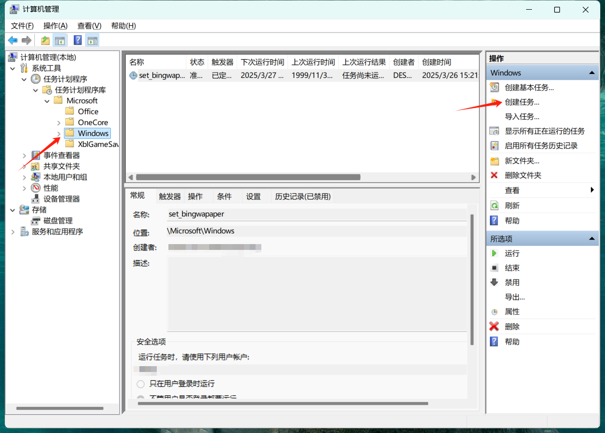
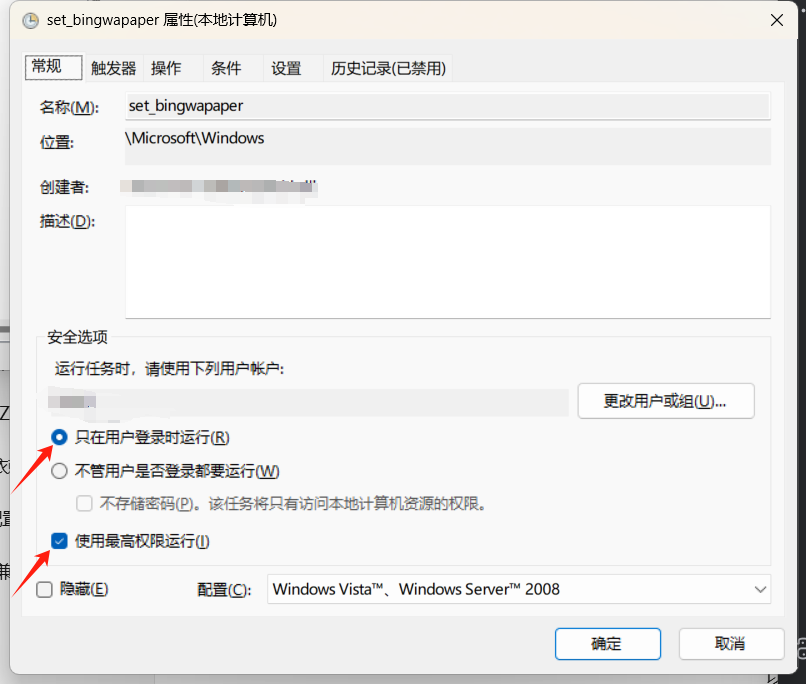
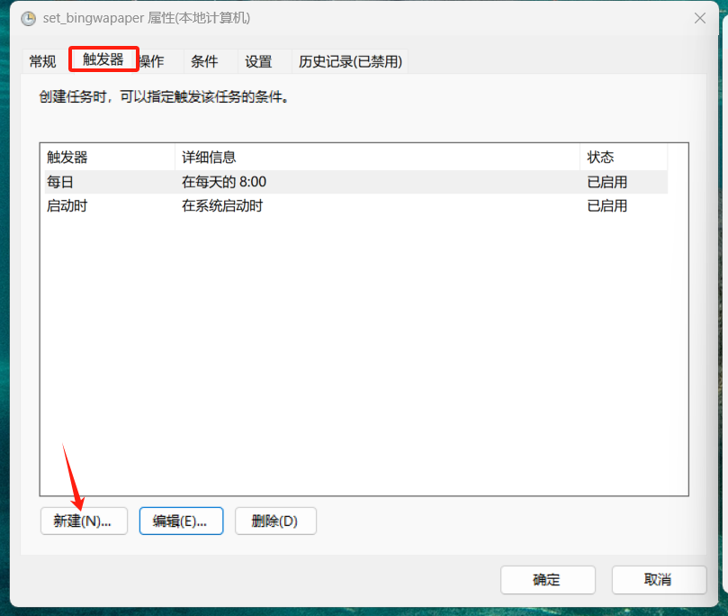
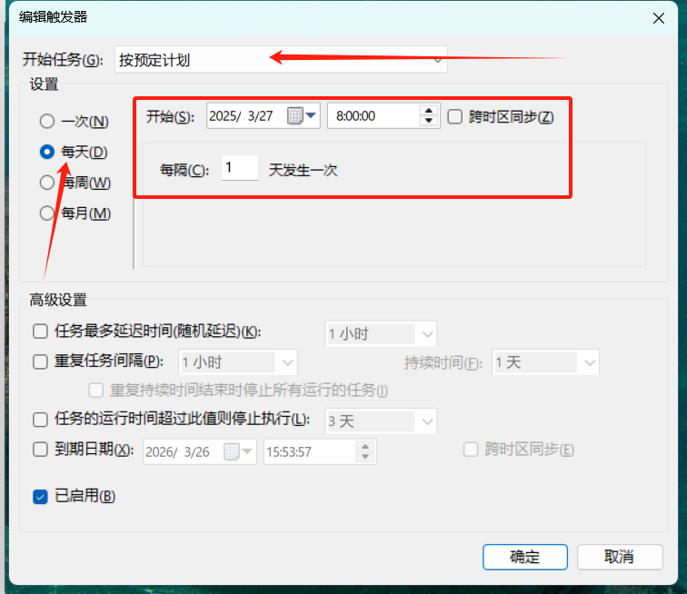
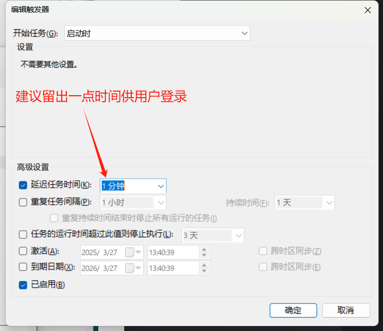
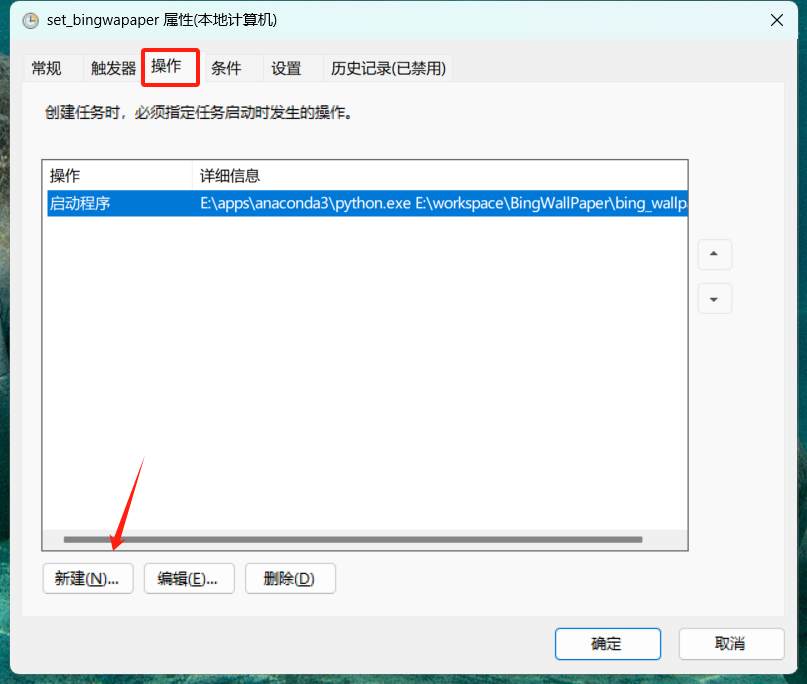
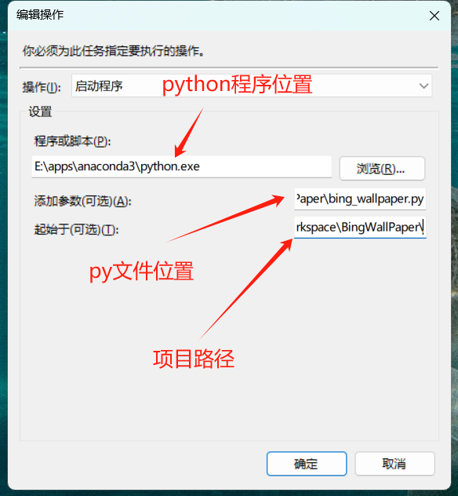
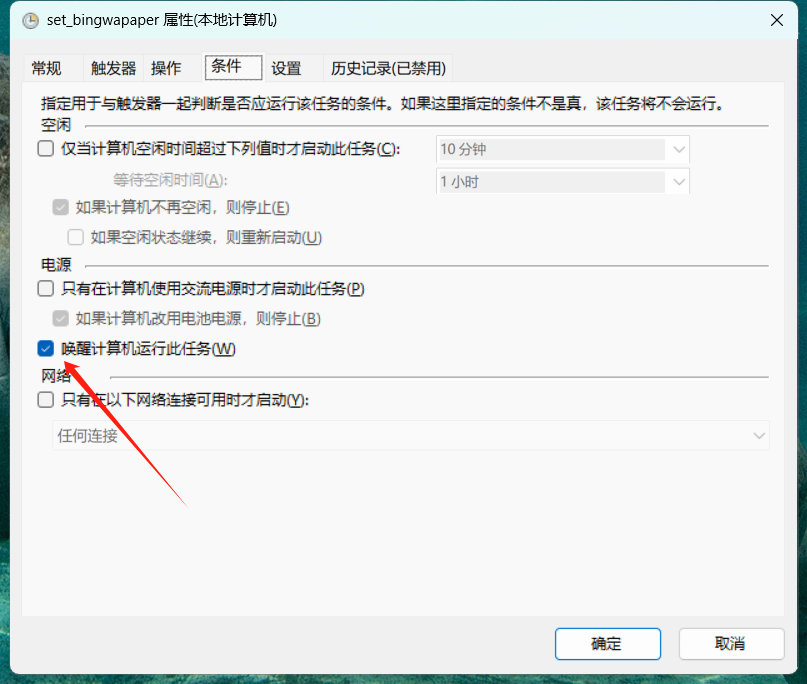
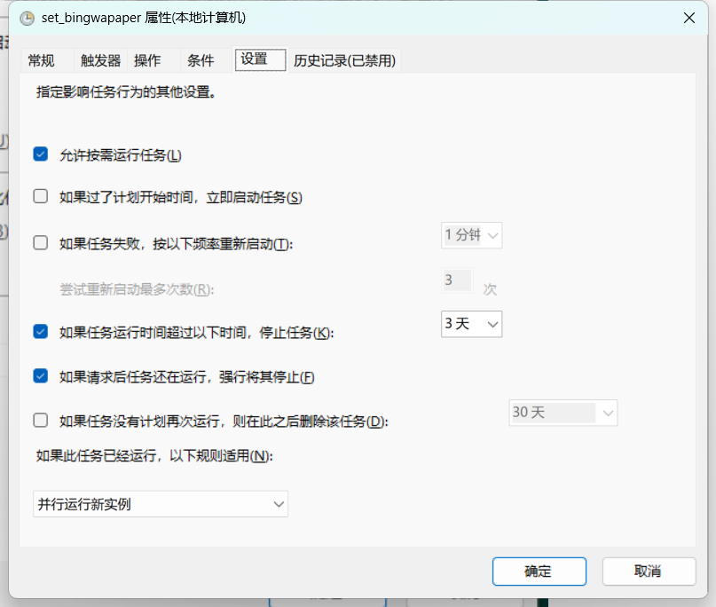

# Bing Wallpaper Auto Updater

[](https://www.python.org/)
[](LICENSE)

## 📌 项目背景

微软必应每日壁纸以其精美的摄影作品广受喜爱，但官方客户端更新存在以下问题：
- 时区同步延迟（通常比网页版晚1-2小时或更久更新）
- 缺乏多历史版本回溯功能
- 无法自动清理旧壁纸文件

本项目通过自动化解决方案实现：
✅ 实时获取最新必应壁纸  
✅ 开机自动更新  
✅ 每日定时刷新  
✅ 本地历史存档（默认保留30天）

## ⚡ 快速开始

### 环境要求
- Windows 10/11
- Python 3.7+

### 安装步骤
1. 克隆仓库：
```powershell
git clone https://github.com/DaPiHai/BingWapaper.git
cd BingWapaper
```

2. Windows任务计划：

   1. 右键Windows图标，进入计算机管理

      

   2. 在目标位置创建任务

      

   3. 为任务起名和设置安全选项（安全选项根据自己需求设置）

      

   4. 根据自己需求设置触发器

      

      

      

      

   5. 新建操作

      

      

      

   6. 条件和设置

      

      

   


## 📄 接口说明

### 图片来源
- `https://bing.img.run/uhd.php`　PHP链接直接输出4k超高清原图。
- `https://bing.img.run/uhd_302.php`　输出4k超高清原图的Bing直链图片。
- `https://bing.img.run/1920×1080.php`　PHP链接直接输出1920×1080分辨率图片。
- `https://bing.img.run/1920x1080_302.php`　输出为1920×1080分辨率的Bing直链图片。
- `https://bing.img.run/1366×768.php`　PHP链接直接输出1366×768分辨率图片。
- `https://bing.img.run/1366x768_302.php`　输出为1366×768分辨率的Bing直链图片。
- `https://bing.img.run/m.php`　PHP链接直接输出1080×1920分辨率竖版图片。
- `https://bing.img.run/m_302.php`　输出为1080×1920分辨率的Bing直链竖版图片。

接口特性：
- 实时同步必应全球站点的最新图片
- 支持分辨率动态适配（根据显示器规格）
- 全球CDN加速

> ℹ️ 本项接口仅作技术研究用途，实际图片版权归属微软及摄影师所有

## ⚠️ 免责声明

1. 本项目为**个人技术研究作品**，与Microsoft无任何关联
2. 所有壁纸资源均通过公开API获取，版权归属原创作者
3. 如收到版权方合理诉求，将在24小时内移除相关代码

开发者声明：
```text
本人基于对必应壁纸的喜爱开发此工具，旨在解决官方客户端更新延迟问题。
若微软官方更新其客户端功能满足需求，将主动归档此项目。
```

## 📬 问题反馈

遇到问题请提交issue或联系：
📧 Email: DaPiHai001@outlook.com  